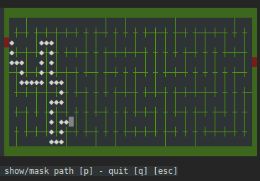

# Crazy Maze

Find path like **a rat** in a random maze.

## Introduction

Crazy Maze is simple game within the term in **C++11**. The game is based on **ncurses** library to manage the interface.\
We can play within differents maze size (small, medium, large, extra large).\
Use Arrow Key to move.



## The Core library

The game is based on a [maze core library](https://github.com/benoit-bst/crazymaze/tree/master/src/maze) in c++11.\
The library contains :

- A Dethp-First Search algorithm to randomly dig the maze.
- Finding shortest path algorithm with BFS algorithm.
- A Printing method

## Debian installation

For the moment, debian package is not available.
You have to manage dependencies :

```bash
sudo apt-get install cmake gcc libncurses5-dev libncursesw5-dev
```

## compilation

```bash
# in root project
mkdir build
cd build
cmake -DENABLE-TESTING=ON ../src
```

## Tests

Only core library tests exist. you can run like this :

```bash
./maze/tests/maze_generator_tests
```
